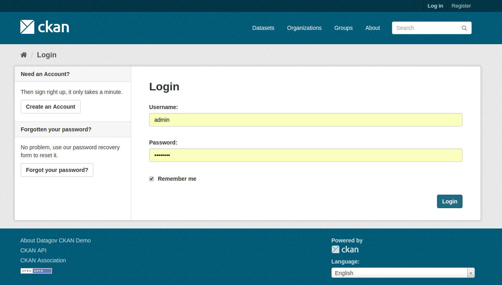
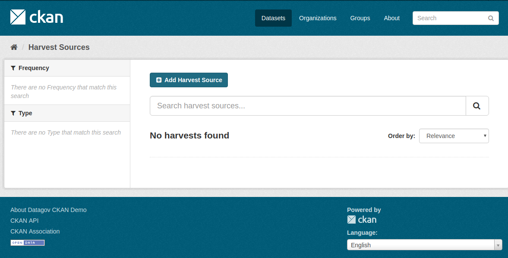
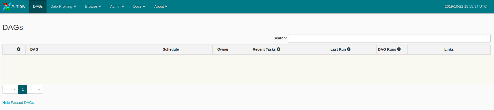
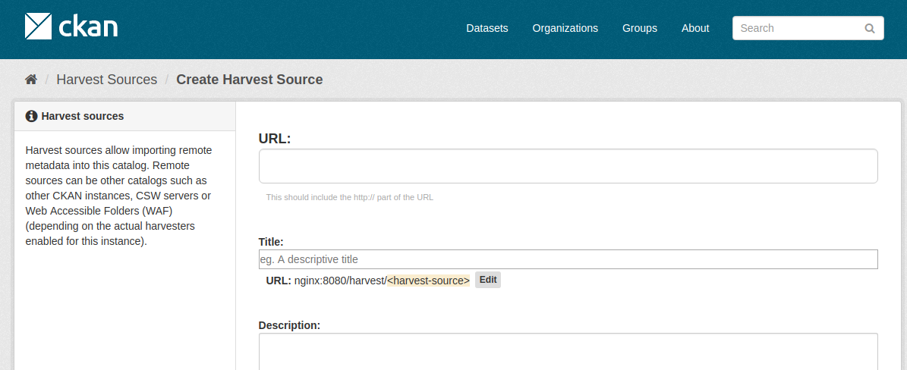
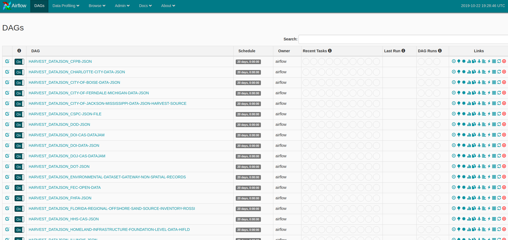

# Running CKAN NG harvester

## Purpose of this document

This document details the procedure to run the CKAN Next Generation harvesters.  
This includes:
 - a CKAN instance to harvest to.
 - Airflow service to schedule and run harvest jobs periodically.

## Related links

- [CKAN NG harvester](https://gitlab.com/datopian/ckan-ng-harvest)
- [Core CKAN harvester](https://pypi.org/project/ckan-harvester/)
- [Airflow](https://airflow.apache.org/)
- [ViderumGlobal/ckan-cloud-docker GitHub repository](https://github.com/ViderumGlobal/ckan-cloud-docker)

## Bring up the CKAN Harvester NG instance

### About the Harvester NG image

The docker image for harvester+airflow is defined in this [GitHub repo](https://gitlab.com/datopian/ckan-ng-harvest).  

### Running the full docker envirnoment

In this repo folder run and follow all steps:

```
./create_secrets.py
```

Start the Docker compose environment with all its components.

```
docker-compose \
      -f docker-compose.yaml \
      -f .docker-compose-db.yaml \
      -f .docker-compose.datagov-theme.yaml \
      -f .docker-compose-harvester_ng.yaml \
      up -d --build nginx harvester
```

Add a hosts entry mapping domain `nginx` to `127.0.0.1`:

```
127.0.0.1 nginx
```

Create a CKAN admin user

```
docker-compose \
      exec ckan ckan-paster \
      --plugin=ckan \
      sysadmin add \
      -c /etc/ckan/production.ini \
      admin password=12345678 \
      email=admin@localhost
```

Now you are able to togin to CKAN at http://nginx:8080 with username `admin` and password `12345678`



Your harvest source list will be empty



## Harvesting

After starts, Airflow will [read all the harvest sources](https://gitlab.com/datopian/ckan-ng-harvest/blob/develop/automate-tasks/airflow/dags/harvest_with_airflow.py) (at the moment just _data.json_ and _CSW_ sources) at the CKAN instance.  

The first time this will be empty, you don't have any harvest source defined in this clean CKAN instance.  
You could check the Airflow status at http://nginx:8080/airflow/.  



In order to fill the CKAN instance with harvest sources you could add it manually at http://nginx:8080/harvest/new.  


Or you can import all the harvest sources from another CKAN instance with the Harvester NG.  
You will need to clone [this repo](https://gitlab.com/datopian/ckan-ng-harvest/blob/develop/automate-tasks/airflow/dags/harvest_with_airflow.py), install the _requirements_ and run the import script.  

In order to define the destination CKAN instance (at http://nginx:8080) you will need to copy the _settings.py_ file as _local_settings.py_ file and define the API key and other required values.  

```
# Data.json type
python3 import_harvest_sources.py --import_from_url https://catalog.data.gov --source_type datajson --method GET
# CSW type
python3 import_harvest_sources.py --import_from_url https://catalog.data.gov --source_type csw --method GET

```

While the harvest sources filled Airflow will read them and create _Dags_



### Other tools

Clean all the data at the images

```
docker-compose \
      -f docker-compose.yaml \
      -f .docker-compose-db.yaml \
      -f .docker-compose.datagov-theme.yaml \
      -f .docker-compose-harvester_ng.yaml \
      down -v
```

Check logs

```
$ docker-compose \
      -f docker-compose.yaml \
      -f .docker-compose-db.yaml \
      -f .docker-compose.datagov-theme.yaml \
      logs -f
```